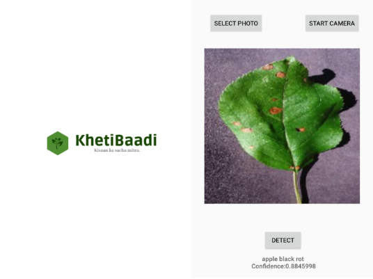
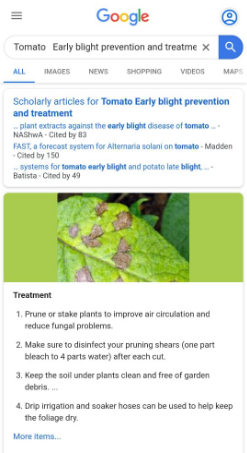
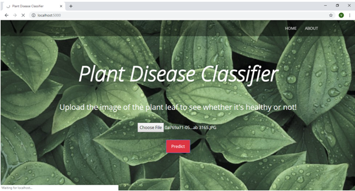
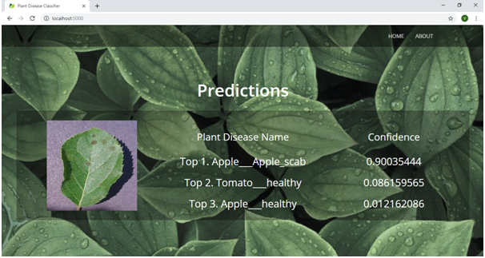
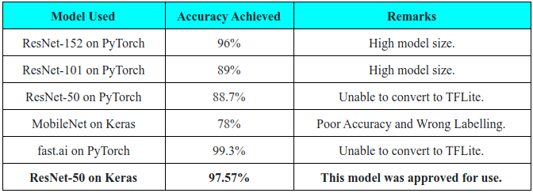

<h1 align="center">:corn::ear_of_rice: KhetiBaadi :leaves::seedling:</h1>

 

 

Plant disease has long been one of the major threats to food security because it dramatically reduces the crop yield and compromises its quality. Accurate and precise diagnosis of diseases has been a significant challenge. ​ According to the Food and Agriculture Organization of the United Nations (UN), transboundary plant pests and diseases affect food crops, causing significant losses to farmers and threatening food security. 

The spread of transboundary plant pests and diseases has increased dramatically in recent years. Globalization, trade and climate change, as well as reduced resilience in production systems due to decades of agricultural intensification, have all played a part. Transboundary plant pests and diseases can easily spread to several countries and reach epidemic proportions. Outbreaks and upsurges can cause huge losses to crops and pastures, threatening the livelihoods of vulnerable farmers and the food and nutrition security of millions at a time.

This makes it important to leverage use of technology available to help the farmers prevent crop loss by making them aware about potential diseases before hand to take preventive measures. **This is the inspiration behind the development of this app.**

### Goals of this project:

* [x] To detect plant disease using leaf picture with high accuracy.
* [x] To detect around top 3 disease probabilities to help users among other chances.
* [x] To provide solutions for the disease detected.
* [x] To make platform available offline so that it can be accessed anytime and anywhere.
* [x] To be able to classify non-leaf images as ‘background’ images so that the model doesn’t give random answers.

**Dataset used for this project: [Plant Village Dataset](https://github.com/spMohanty/PlantVillage-Dataset) and [Stanford's open background dataset](http://www.cs.cmu.edu/~dmunoz/projects/infer_machine/sbd_2013_04/).**

Some sample images: 

 

---

### **Demo:** 

### Android App:

 

### Flask WebApp: 

 

 

---

We tried out various deep learning frameworks, beginning with PyTorch, to explore them and to figure out which one would give us a good model that can be converted to mobile compatible version. Here's a summary of what we achieved:

### Future scope of this project:

* [ ] Reduce the app size (currently less than 100 MB).
* [ ] To provide an in-app solution to the disease provided to make the app purely offline. 
* [ ] To provide multi lingual support for farmers so that they understand better.
* [ ] Make visual help available and connect farmers to government schemes for agriculture directly through the app.

 

#### This project still has scope of development, so you can also contribute to this Project as follows:
* [Fork](https://github.com/arghyadeep99/KhetiBaadi) this Repository.
* Clone your Fork on a different branch:
	* `git clone -b <name-of-branch> https://github.com/arghyadeep99/KhetiBaadi.git`
* After adding any feature:
	* Goto your fork and create a pull request.
	* We will test your modifications and merge changes.

This project was done `as a part of our internship under E-Yantra, IIT Bombay.`

---
<h3 align="center"><b>Developed with :heart: by <a href="https://github.com/arghyadeep99">Arghyadeep Das</a><a href="https://github.com/vidyam99">, Vidya Makwana</a> and <a href="https://github.com/Maaayank">Mayank Patel</a>.</b></h1>
